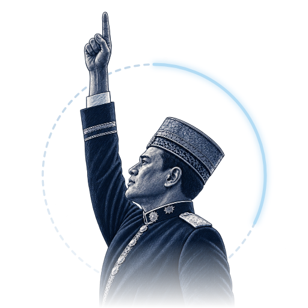
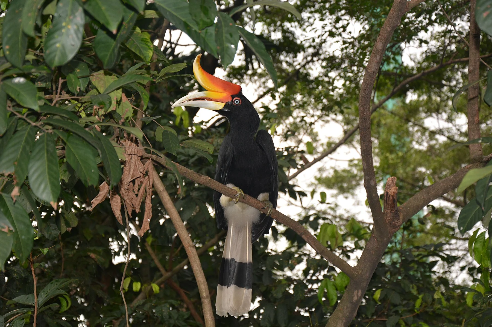
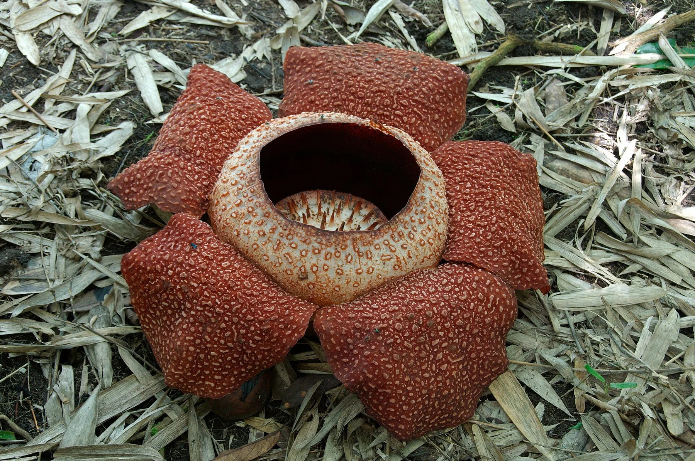
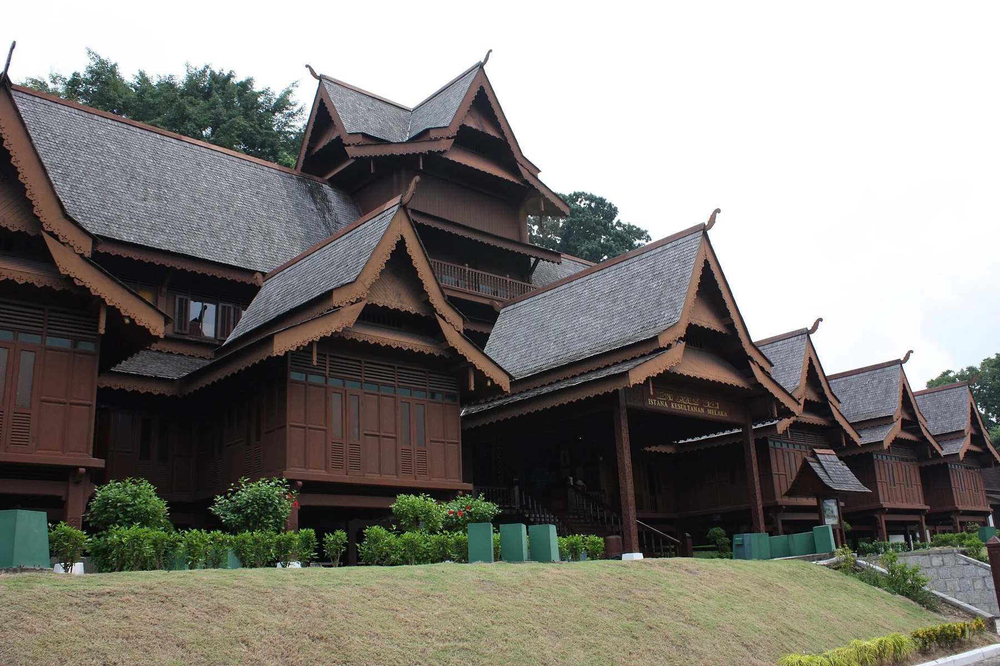

  

<h1 align="center">MERDEKA</h1>

  <strong>A brighter Malaysia, together.</strong>

  A journey through the places, flavours, and traditions that make Malaysia feel like home.

<h3 align="center">
  <a href="https://lownamlee.com/merdeka/">🇲🇾 Enter the experience</a>
   · 
  <a href="#seven-letters-many-stories">Explore the letters</a>
</h3>

---

## From a raised hand to a rising skyline

A crowd in deep blue. A hand raised. The first light of a new day.

The opening counter rises from **1 to 69**, marking Malaysia’s **69th Independence
Day in 2026**. Its final number is a tribute to the occasion at the heart of this
experience.

The opening gives way to Merdeka 118, a warm sunrise, and the Jalur Gemilang.
It begins with a gesture of independence and looks toward what comes next.

Then **MERDEKA** becomes an invitation. Choose a letter and discover a different
part of Malaysia. The flag stays with you throughout the journey.

## Seven letters, many stories

| Letter | Discover | A glimpse inside |
| :---: | --- | --- |
| **M** | **Malaysia** | City skylines, everyday streets, and a country of many cultures. |
| **E** | **Enggang** | A golden casque and black-and-white wings; an emblem of Sarawak. |
| **R** | **Rafflesia** | A fleeting bloom on the rainforest floor. |
| **D** | **Durian** | A thorned shell, golden flesh, and a flavour that starts conversations. |
| **E** | **Empayar Melaka** | A maritime crossroads where traders, languages, and cultures met. |
| **K** | **Keris** | Metalwork, carving, ceremony, and an heirloom passed through generations. |
| **A** | **Angklung** | Bamboo voices coming together, one note at a time. |

<table>
  <tr>
    <td align="center" width="33%">
      
       Enggang
    </td>
    <td align="center" width="33%">
      
       Rafflesia
    </td>
    <td align="center" width="33%">
      
       Empayar Melaka
    </td>
  </tr>
</table>

## Take a moment to explore

Let the opening unfold, then follow your curiosity. Browse the photographs,
listen to angklung in the UNESCO film, or follow a source to learn a little more.
Move between letters at your own pace, and return to the skyline whenever you like.

The stories reach beyond borders, too. Keris and angklung sit within a wider
regional heritage; the chapters acknowledge those connections and origins.

---

  <strong>Selamat datang.</strong> 
  <a href="https://lownamlee.com/merdeka/">Discover Malaysia, one letter at a time.</a>

  Created by <a href="https://github.com/lownamlee">Low Nam Lee</a> for Merdeka WebForge 2026.

